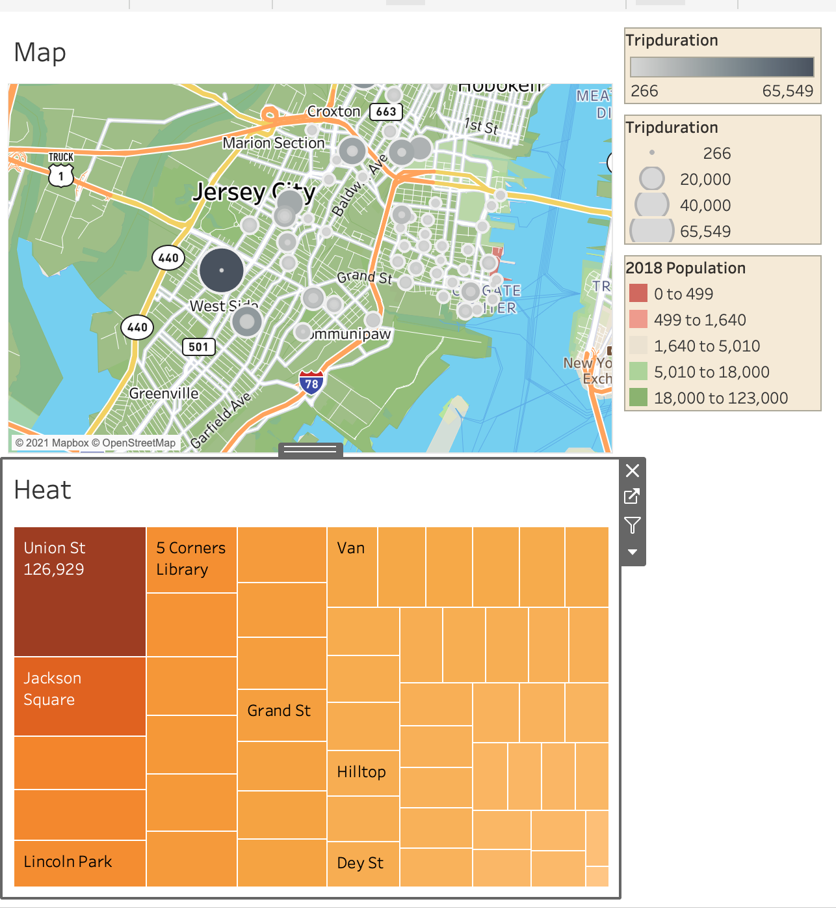
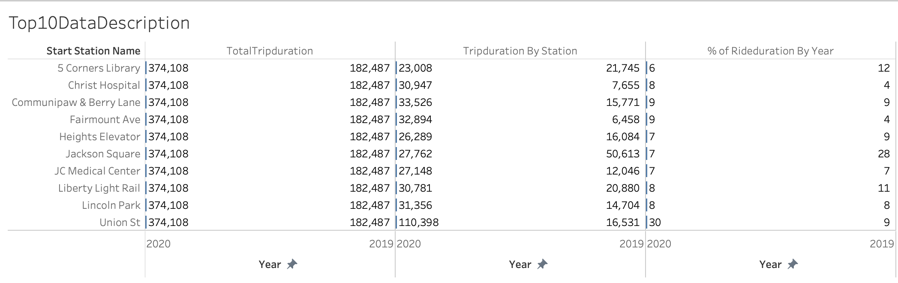
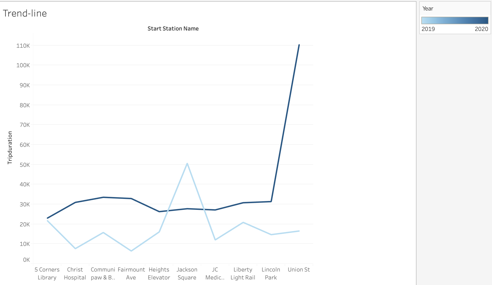
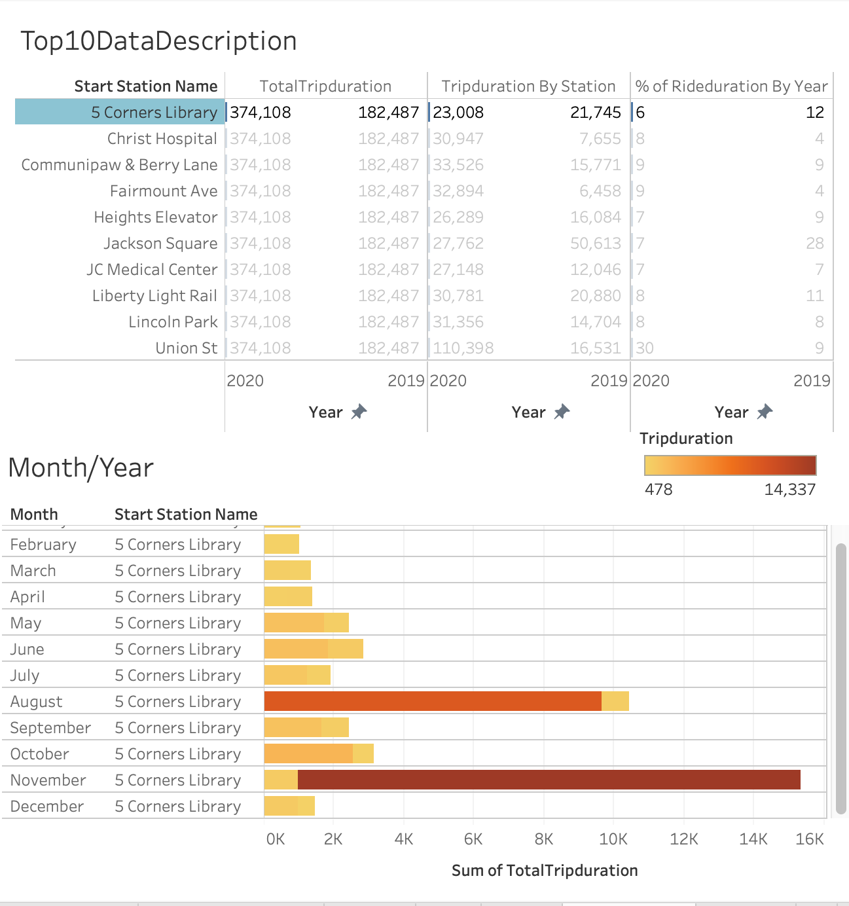

# Tableau Homework - Citi Bike Analytics

### Before You Begin

* You will create both a GitHub repository and a published Tableau Public link. 

* If you haven't already, be sure to create a Tableau Public account [here](https://public.tableau.com/s/).

* The free tier of Tableau only lets you save to their public server. This means that each time you save your file it will be uploaded to your Tableau Public profile.

* You are able to load and continue working on the same workbook.

* When you are finished with your assignment, you will turn in the URL to your Tableau Public workbook along with your GitHub link.

## Background

Congratulations on your new job! As the new lead analyst for the [New York Citi Bike](https://en.wikipedia.org/wiki/Citi_Bike) Program, you are now responsible for overseeing the largest bike sharing program in the United States. In your new role, you will be expected to generate regular reports for city officials looking to publicize and improve the city program.

Since 2013, the Citi Bike Program has implemented a robust infrastructure for collecting data on the program's utilization. Through the team's efforts, each month bike data is collected, organized, and made public on the [Citi Bike Data](https://www.citibikenyc.com/system-data) webpage.

However, while the data has been regularly updated, the team has yet to implement a dashboard or sophisticated reporting process. City officials have a number of questions on the program, so your first task on the job is to build a set of data reports to provide the answers.

## Task

**Your task in this assignment is to aggregate the data found in the Citi Bike Trip History Logs and find two unexpected phenomena.** 

Design 2-5 visualizations for each discovered phenomena (4-10 total). You may use any dataset or combination of dataset. Be aware, however, that these csv's are very large. If you want to work with multiple csv's, you will have to do some aggregations using pandas and export smaller csv's. Otherwise, Tableau will break. Keep your project within the scope of the csv's.

Your final project must be cohesive. The point of visualizations is telling a story. Each visualization should stand on its own and be a part of the overall story. Are you presenting data on gender differences to to show the officials Citibike needs to change its model? Are you analyzing the difference between pre and post covid usage? Each visual should support this story.

You can also create your project for a different audience if you wish--Citibike Corporate for example.

## Process

Data: 
  * Aggregated monthly csv files for CitiBike data for the years 2019 & 2020
  * Used the groupby function to group the data by the Stationi name in order to analyze the average trip duration by Station and by month/year.
    * Consolidated the data into a new csv file in order to prevent Tableau from crashing due to the high row count.

Visualization:
  * I've created a map along with a heat visual in order to identify the concentration of ride(duration) by trip station.
  
  * Once identified, I was able to create a visual that described the station's data/information
  
  * A trend-line was used to display the increase and/or decrease in trip(duration)
  
  * Lastly, once we identified if there was a spike and/or decrease I created a dashboard to identify what month in 2019 and 2020 had the greatest ride(duration) difference.
  

## Analysis

   *I was a little surpised to see that the length of ride(duration) for the top 10 Bike Stations had increased overall from 2019 to 2020.
   *When taking a further look you notice that in fact the top 10 starting ride stations are almost all either located at some sort of hospital OR nearby to.
   * It is not clear why this happened however, one might suggest that the reason for the spike is correlated to the recent deadly pandemic the world is facing
   * From this information we can interpret that transportation to and from(or close to) Hospitals is very key!!! 
   * When looking at the last visualization we notice a HUGE spike in trip duration for the Union St. station for the months of November and December of 2020, but why?
   * Sometime around mid to late last year the Mayor of Hoboken and Jersey citi annouced the two city partnership that would grant CitiBike the capacity to provide bike sharing bikes to and from the cities.
   * This only solidifies the suggestion that CitiBike executives should continue to focus their expansion of bike stations that are located at or near hospital and or health(subsidaries).
   * In addition to, CitiBike should continue their focus on expanding partnerships from big cities like hoboken and jersey city in order to increase the likeliness of having longer trip durations.

